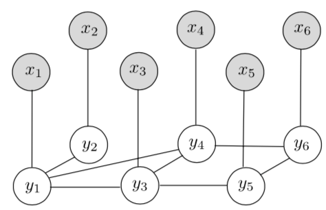

# 第六章 关系排序

**摘要：**在本章中，我们介绍了一种新的学习排序方法，它不仅考虑了排序过程中每个文档的属性，而且考虑了文档之间的相互关系。 根据不同的关系（例如，相似性，偏好和不相似性），有不同的方法能对应于不同的实际应用场景（例如，伪相关反馈，主题分布和搜索结果多样化）。 本章回顾了解决这一新问题的几种方法，并讨论了沿这方面的未来研究方向。

如前几章所示，在大多数情况下，假定排序列表是通过根据评分函数输出的文档分数对文档进行排序而生成的。也就是说，假设$$h$$可以表示为$$◦f(x)$$，函数$$f$$可以在独立于其他文档的单个文档上运行。但是，在某些实际情况下，应考虑文档之间的关系，仅定义单个文档的评分函数$f$是不合适的。例如，在主题提炼[3]的任务中，如果某个页面及其父页面（在站点网络中）与查询具有相似的相关性，则希望将父页面置于子页面之上。在伪相关性反馈的情况下，假定了即使他们的相关特征不同但是相似度接近，他们也会排的很近。在搜索结果多样化的情况下，将排名非常相似的文档都排在首其实并不理想。

在文献中，有几种尝试将文档之间的相互关系引入排序过程。 为了便于参考，我们将这种排序称为“相关排名”。 在本章中，我们将首先介绍一个用于关系排序的统一框架[6，7]，然后介绍一些专门针对搜索结果多样化的工作[1，4，8，9]。

## 6.1 关系排序的整体框架

### 6.1.1 基于SVM的关系排序

通过考虑排序过程中的关系，可以对排序函数进行如下细化，其中函数$$h$$称为关系排序函数[6]。
$$
h(x)=h(f(x),R) \tag{6.1}
$$
在这里，$$f$$仍然可以理解为对每个单个文档进行操作的评分函数，矩阵$$R$$描述了文档之间的关系。 然后有几种参数化$$h(x)$$的方法。 例如，可以让$$f$$包含参数$$w$$，而对$$f$$和$$R$$进行积分的方式是预先定义的。 也可以将$$f$$视为固定函数，而$$h$$具有自己的参数。 最复杂的情况是$$f$$和$$h$$都包含参数。 在[6]中，讨论了第一种情况，并假定
$$
h(x)=h(f(w,x),R)=arg\,\underset{z}{min}\{l_1(f(w,x),z)+\beta l_2(R,z)\} \tag{6.2}
$$
其中$$l_1$$是确保$h$给出的排名结果与$f$给出的排名结果没有太大差异的目标函数，而$l_2$是保证排名结果应与关系要求$R$尽可能一致的另一个目标函数。

然后，对于主题提炼和伪相关性反馈，关系排名函数$h$得到了进一步的深入研究。 令人高兴的是，在这两种情况下，存在关系排名函数的闭式解。 对于伪相关性反馈，最终可以得到，
$$
h(f(w,x),R)=(I+\beta(D-R))^{-1}f(w,x) \tag{6.3}
$$
其中$$I$$表示一个单位矩阵，$$D$$表示对角矩阵$$D_{i,i}=\sum_j{R_{i,j}}$$。

而对于主题提取，有
$$
h(f(w,x),R)=(2I+\beta (2D-R-R^T))^{-1}(2f(w,x)-\beta r) \tag{6.4}
$$
其中$$r_j=\sum_iR{i,k}-\sum_jR_{k,j}$$。

可能已经注意到，在关系排序框架中，有两种不同的输入：一种是文档$$x$$的特征，另一种是关系矩阵$$R$$。这似乎与提到的传统学习排序方法大不相同。 在前面的章节中。 但是，将其抽象为$$x =\phi(q,d)$$且$$R =\psi(d，d)$$，则可以发现输入仍然是文档和查询。 唯一的区别在于，现在我们还关心文档之间的相互依赖性，而以前每个文档都是以独立的方式处理的。

关系排序函数可以替换为本书介绍的任何学习排序算法。 特别地，在[6]中给出了使用Rating SVM学习关系排序函数的演示。 相应的算法称为“ Relational Ranking SVM（RRSVM）”。 RRSVM的矩阵形式表达式如下。

用于伪相关性反馈的R SVM可以表示为以下优化问题：
$$
\begin{align*}
&\underset{w,\xi^{(i)}}{min}{\frac{1}{2}||w||^2}+\lambda\displaystyle\sum^{n}_{i=1}1^{(i)T}\xi^{(i)},  \\
s.t.\ \ \  &C^{(i)}h(f(w,x^{(i)}),R^{(i)}) \geq 1^{(i)}-\xi^{(i)}, \xi{(i)}\geq0\\
&h(f(w,x^{(i)}),R^{(i)})=(I-\beta(D^{(i)}-R^{(i)}))^{-1}f(w,x^{(i)})
\end{align*}
\tag{6.5}
$$
其中$$C^{(i)}$$表示一个约束查询的矩阵，$$1^{(i)}$$表示所有元素均为1的向量，他的维数与$$\xi^{(i)}$$相同。$$C^{(i)}$$的每行表示一个成对的约束，一个为1而另一个为-1，其他均为0，例如对查询$$q_i$$，如果标注为$$y_1>y_3$$且$y_2>y_4$，则有
$$
C^{(i)}=(\begin{matrix} 1&0&-1&0\\0&1&0&-1 \end{matrix})
$$
针对主题提取的RRSVM能表示为如下优化问题
$$
\begin{align*}
&\underset{w,\xi^{(i)}}{min}{\frac{1}{2}||w||^2}+\lambda\displaystyle\sum^{n}_{i=1}1^{(i)T}\xi^{(i)},  \\
s.t.\ \ \  &C^{(i)}h(f(w,x^{(i)}),R^{(i)}) \geq 1^{(i)}-\xi^{(i)}, \xi{(i)}\geq0\\
&h(f(w,x^{(i)}),R^{(i)})=(2I+\beta (2D^{(i)}-R^{(i)}-R^{{(i)}T}))^{-1}(2f(w,x^{(i)})-\beta r^{(i)})
\end{align*}
\tag{6.6}
$$
进一步的讨论表明，尽管排序函数变得更加复杂，但人们只需要预处理与给定查询相关的所有文档的功能，并且仍然可以使用标准的排序SVM工具包来执行学习和测试（例如http://olivier.chapelle.cc/primal/ 和 http://www.cs.cornell.edu/People/tj/svm_light/svm_rank.html.）。因此新算法在实际应用中非常可行。 文献[6]中的实验结果表明，对于特定的学习任务，RRSVM可以明显胜过Rank SVM和其他启发式方法，例如Lemur toolkit（http://www.lemurproject.org/）中提供的伪相关反馈方法和基于站点网络的相关传播[5]。

### 6.3.2 连续条件随机场

在[7]中，Qin等人。 也研究了关系排序的形式化，但使用的是称为连续条件随机场（C-CRF）的图模型。 C-CRF是一个图模型，如图6.1所示。 在有条件的无向图中，白色结点表示排序得分，灰色结点表示文档，两个白色结点之间的边缘表示排序得分之间的依存关系，灰色结点和白色结点之间的边缘表示对文档排序得分的一个依赖关系（原则上，排序得分可以依赖于查询的所有文档；在这里，为了便于展示，我们考虑了仅考虑相应文档的简单情况。）

特别地，定义$$\{g_k(y_j,x)\}^{K_1}_{k=1}$$是一组定义于文档集合$$x$$和标签$$y_j(j=1,...,m)$$ 的实值特征函数集，$$\{g_k'(y_u,y_v,x)\}^{K_2}_{k=1}$$是一组建立在$$y_u$$，$$y_v$$和$$x(u,v=1,...,m,u\neqv)$$的实值特征函数集，C-CRF则是具有以下密度函数的条件概率分布，
$$
Pr(y|x)=\frac{1}{Z(x)}exp\{\sum_j\displaystyle\sum_{k=1}^{K_1}\alpha_kg_k(y_j,x)+\sum_{u,v}\displaystyle\sum_{k=1}^{K_2}\beta_kg_k'(y_u,y_v,x)\} \tag{6.7}
$$
其中$$\alpha$$是一个$$K_1$$维参数向量，$$\beta$$是一个是一个$$K_2$$维参数向量，$$$Z(x)$是一个归一化函数。
$$
Z(x)=\int _y expexp\{\sum_j\displaystyle\sum_{k=1}^{K_1}\alpha_kg_k(y_j,x)+\sum_{u,v}\displaystyle\sum_{k=1}^{K_2}\beta_kg_k'(y_u,y_v,x)\}dy \tag{6.8}
$$
给定训练数据$\{{x^{(i)},y^{(i)}}\}^{n}_{i=1}$，可以使用极大似然估计来估计C-CRF的参数$\{\alpha,\beta\}$。特别地，相对于C-CRF模型，训练数据的条件对数似然可计算如下：
$$
L(\alpha,\beta)=\displaystyle\sum_{i-i}^nlog\,\Pr(y^{(i)}|x^{(i)};\alpha,\beta) \tag{6.9}
$$
然后，使用梯度上升方法最大化对数似然率，然后将学习到的参数用于对新查询的文档进行排名。 具体来说，给定新查询的文档$x$，
$$
h(x)=arg \,\underset{y}{max}\,Pr(y|x) \tag{6.10}
$$
借助上述C-CRF的一般思想，在[7]中，讨论了如何为某些关系排序任务（例如主题提炼和伪相关性反馈）定义特征函数的特定形式和条件概率。 在这些特定情况下，已在[7]中给出最佳排序函数具有封闭形式的解决方案。 这极大地简化了训练和测试过程。

例如伪相关性反馈的最佳排序函数采用以下形式：
$$
F(x)=(\alpha^TeI+\beta D-\beta R)^{-1}x\alpha \tag{6.11}
$$
其中$$e$$是一个$$K_1$$维的元素全为1的向量，$I$是一个$m\times m$的单位矩阵，$R$是一个相似度矩阵，D是一个$m\times m$的对角矩阵，有$D_{i,i}=\sum_jR_{i,j}$。

对另一个例子，主题抽取的最佳排序函数采用以下形式：
$$
h(x)=(\frac{1}{\alpha^Te}(2x\alpha+\beta(D_r-D_c)e) \tag{6.12}
$$
其中$D_r$$D_c$是两个对角矩阵，有$D_{ri,i}=\sum_jR_{i,j}$与$D_{ci,i}=\sum_jR_{j,i}$。

LETOR基准数据集的实验结果表明，C-CRF在主题提取和伪相关性反馈的任务上的性能明显优于传统的学习排序方法。

## 6.2 学习多样性排序

理想情况下，前一节介绍的关系排序框架可以通过使用适当的关系定义其目标函数来处理各种关系排序任务。然而，在[6]和[7]中没有给出关于如何使用该框架学习多样性排序的具体例子。另一方面，有几篇独立的著作研究了搜索结果多样化的问题。例如，在[9]中，Yue等人，研究如何使用结构化SVM预测各种子集。在[8]中，提出了两种在线学习算法，即排序探索和提交算法，bandit排序算法，用于根据用户的点击行为直接学习各种文档排序。在[1]中，在给出查询和文档的主题类别的情况下，提出了关于搜索结果多样化的概率公式。在[4]中，讨论了任何多元化系统都应满足的公理。我们将在本小节中更详细地介绍[1]和[4]。

在[1]中，研究了如何通过明确使用有关查询或文档可能涉及的主题的知识来使搜索结果多样化。 具体来说，假设存在信息分类法，并且用户意图的多样性是在分类法的主题级别上建模的。 在此基础上，提出了一个明确权衡相关性和多样性的目标，如下所示：
$$
P(X|q)=\sum_cP(c|q)(1-\prod_{x\in S}(1-V(x|q,c))) \tag{6.13}
$$
其中$V(x|q,c)$表示文档$x$对查询$q$在意图分类为$c$情况下的相关概率。

对上述目标进行概率解释并不难。 实际上，它准确地描述了文档集$S$中至少一个文档满足发出查询$q$的平均用户（就期望而言）的可能性。

已经证明优化上述目标的一般问题是NP难题。 好消息是目标函数允许使用次模函数[12]，可用于实现良好的近似算法。 直观上，次模函数满足边际收益递减的经济原理，即，将文档添加到较大的集合中的边际收益小于将文档添加到较小的集合中的边际收益。 利用此属性，可以设计贪婪算法。

给定一些经典的排序算法为目标查询选择的前$k$个文档，贪心算法对这些文档重新排序以使目标$P(S|q)$最大化。 令$U(c|q,S)$表示查询$q$属于类别$c$的条件概率，假设集合$S$中的所有文档都无法满足用户的需求。 最初，在选择任何文档之前，$U(c | q,\empty)= P(c|q)$。 该算法一次选择一个输出文档。 在每一步中，它都会选择边际效用最高的文档，定义如下：
$$
g(x|q,c,S)=U(c|q,S)V(x|q,c) \tag{6.14}
$$
边际效用可以解释为在所有文档都未能满足所选文档的前提下，所选文档满足用户的可能性。 在循环的最后，使用贝叶斯规则更新条件分布以反映新文档包含到结果集中。

至于算法，贪婪的启发法可以得到最佳的多样化结果。 一些进一步的分析表明，即使不满足条件，我们也可以很好地界定贪婪方法的近似误差。

受前述新算法的启发，[1]的作者进一步提出将信息检索中现有的评估措施改进为意图识别。 例如，现在NDCG和MAP将变为
$$
NDCG_{IA}@k=\sum_cP(c|q)NDCG@k \tag{6.15}
$$

$$
MAP_{IA}@k=\sum_cP(c|q)MAP@k \tag{6.15}
$$

实验结果表明，该方法在意图识别方面可以明显优于以前的方法。

在[4]中正式指出，在大多数情况下，多样化问题可以被描述为一个双准则优化问题。 就是说，多元化可以看作是排序（在较高的位置上显示更多相关的结果）和聚类（满足相似意图的文档进行分组）的结合，因此实现了选择一组最相关但新颖的文档的模糊目标。 考虑到上述方面的非常一般的目标函数可以表述如下。
$$
L(S_k,q,f(·),d(·,·)) \tag{6.17}
$$
其中$S_k$是一个是在前k个位置显示的文档子集，$q$是给定查询，$f(·)$是相关性函数，而$d(·，·)$是距离函数。

然后此处给出一套简单的性质（称为公理），任何一个多样化系统都应满足以下要求（请注意，在某些情况下，这些公理可能不是必需的。 例如，有时合理的情况是，一个好的多元化系统不具有稳定性，因为稳定性某种程度上意味着贪婪的系统，而贪婪的系统可能不是最优的。）。

- 缩放不变性：此属性表明集合选择函数对输入函数$f(·)$和$d(·，·)$的缩放不敏感。
- 一致性：一致性指出，使输出文档更相关，更多样化，而使其他文档不那么相关和多样化，则不应改变排名的输出。
- 丰富度：丰富度条件指出，只要正确选择相关性和距离函数，我们就应该能够实现任何可能的输出集。
- 稳定性：稳定性条件旨在确保输出集不会随输出大小任意变化。也就是说，最佳top-(k +1)子集应该是最佳top-k子集的超集。
- 不相关属性的独立性：该公理指出，集合的分数不受集合外文档大多数属性的影响。
- 单调性：单调性简单地说，添加任何文档不会降低集合的分数。
- 相关性强度：此属性确保没有函数L忽略相关性函数。
- 相似性强度：此属性可确保没有函数L忽略距离函数。

然而，在[4]中指出，没有函数L可以满足所有八个相关性。 例如，[1]中的目标函数违反了无关属性的稳定性和独立性公理。 因此，人们只能希望满足部分公理。 以下是一些此类示例：

1. 最大和多样化，满足除稳定性以外的所有公理。

$$
L(S)=(k-1)\sum_{u\in S}f(u)+2\lambda\sum_{u,v\in S}d(u,v) \tag{6.18}
$$

2. 最大最小多样化，除了一致性和稳定性外，它满足所有公理。

$$
L(S)=\underset{u\in S}{min}{f(u)}+\lambda\underset{u,v \in S}{min}\, {d(u,v)} \tag{6.19}
$$

3. 单目标公式，除了一致性以外，它满足所有公理。

$$
L(S)=\sum_{u\in S}f(u)+\frac{\lambda}{|U|-1}\sum_{u,v\in S}d(u,v) \tag{6.20}
$$

除了上面介绍的两篇论文外，还有许多其他关于学习多样化排序的论文。 实际上，学习多样化排序的任务已经成为研究界的热门研究课题。 在2009年，TREC会议甚至为搜索结果的多样化设计了一项特殊任务。 多样性任务的目标是返回排序的页面列表，这些页面一起为查询提供完整的覆盖范围，同时避免结果列表中的过多冗余。

在任务中，使用了50个查询。 每个查询的子主题均基于从商业搜索引擎的日志中提取的信息，并且在受欢迎程度方面大致保持平衡。 每个主题都被构造为一组代表性的子主题，每个子主题都与不同的用户需求相关。 根据子主题判断文档。 对于每个子主题，评估人员将对文档是否满足与子主题相关的信息需求做出二元判断。 α-NDCG[2]和MAPIA [1]被用作评估手段。 有关更多信息，请参见任务的网站：http://plg.uwaterloo.ca/~trecweb/。

## 6.3 小结

在本章中，我们介绍了一些有关关系排名的现有论文。 尽管这些论文为传统排序学习任务之外的新任务打开了一个窗口，但仍有许多问题需要进一步研究。

- 如前所述，目前尚不清楚如何使用一般的关系排序框架来解决学习多样化排名的问题。目前需要仔细研究这个问题，以使一般的关系排序框架真正具有普遍性。
- 在本章介绍的算法中，多样性是通过任意两个文档之间的距离或相异性来建模的。但是，这可能与用户的实际行为不一致。原因是用户通常不会检查结果列表中的每个文档，而是以自上而下的方式浏览排名结果。因此，将多样性定义为给定文档和所有在其之前排名的文档之间的关系会更有意义。
- 在本章介绍的所有算法中，关系是成对的：相似性，不相似性或偏好。因此，矩阵（或图）用于对关系进行建模。但是，在实际应用中，还有其他一些关系可能会超出“成对”的关系。例如，同一网站中的所有网页都具有多向关系。使用张量（或超图）来建模这种多向关系更为合适。因此，应该升级相对排序框架（请注意，张量和超图可以包含矩阵和图作为特殊情况）。

## 参考文献

1. Agrawal, R., Gollapudi, S., Halverson, A., Ieong, S.: Diversifying search results. In: Proceedings of the 2nd ACM International Conference on Web Search and Data Mining (WSDM 2009), pp. 5–14 (2009)
2. Clarke, C.L., Kolla, M., Cormack, G.V., Vechtomova, O., Ashkan, A., Buttcher, S., MacKin- non, I.: Novelty and diversity in information retrieval evaluation. In: Proceedings of the 31st Annual International ACM SIGIR Conference on Research and Development in Information Retrieval (SIGIR 2008), pp. 659–666 (2008)
3. Craswell, N., Hawking, D., Wilkinson, R., Wu, M.: Overview of the trec 2003 web track. In: Proceedings of the 12th Text Retrieval Conference (TREC 2003), pp. 78–92 (2003)
4. Gollapudi, S., Sharma, A.: An axiomatic approach for result diversification. In: Proceedings of the 18th International Conference on World Wide Web (WWW 2009), pp. 381–390 (2009)
5. Qin, T., Liu, T. Y., Zhang, X. D., Chen, Z., Ma, W. Y.: A study of relevance propagation for web search. In: Proceedings of the 28th Annual International ACM SIGIR Conference on Research and Development in Information Retrieval (SIGIR 2005), pp. 408–415 (2005)
6. Qin, T., Liu, T.Y., Zhang, X.D., Wang, D., Li, H.: Learning to rank relational objects and its application to web search. In: Proceedings of the 17th International Conference on World Wide Web (WWW 2008), pp. 407–416 (2008)
7. Qin, T., Liu, T.Y., Zhang, X.D., Wang, D.S., Li, H.: Global ranking using continuous conditional random fields. In: Advances in Neural Information Processing Systems 21 (NIPS 2008), pp. 1281–1288 (2009)
8. Radlinski, F., Kleinberg, R., Joachims, T.: Learning diverse rankings with multi-armed bandits. In: Proceedings of the 25th International Conference on Machine Learning (ICML 2008), pp. 784–791 (2008)
9. Yue, Y., Joachims, T.: Predicting diverse subsets using structural SVM. In: Proceedings of the 25th International Conference on Machine Learning (ICML 2008), pp. 1224–1231 (2008)

