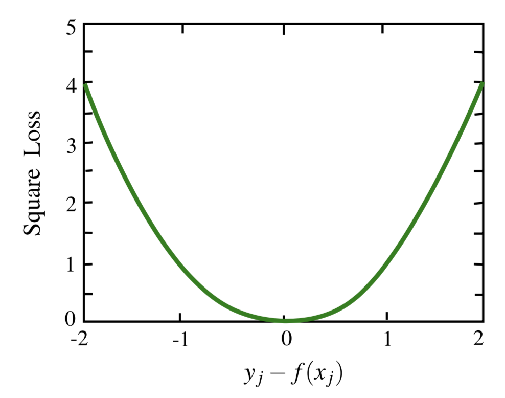
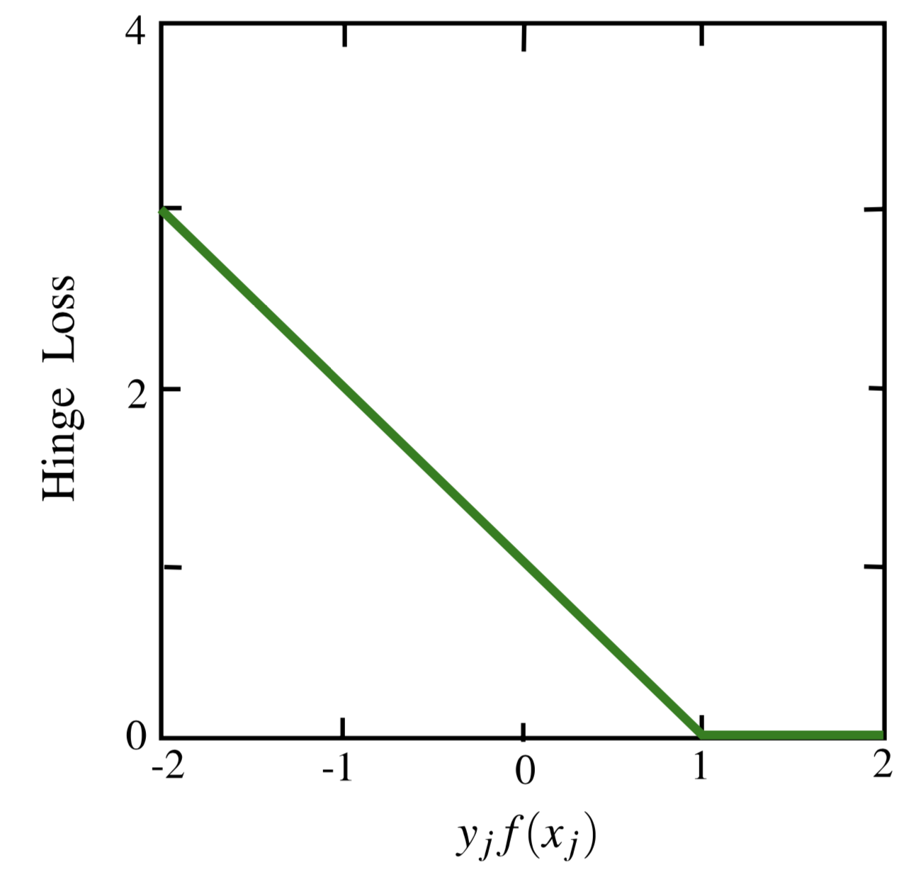
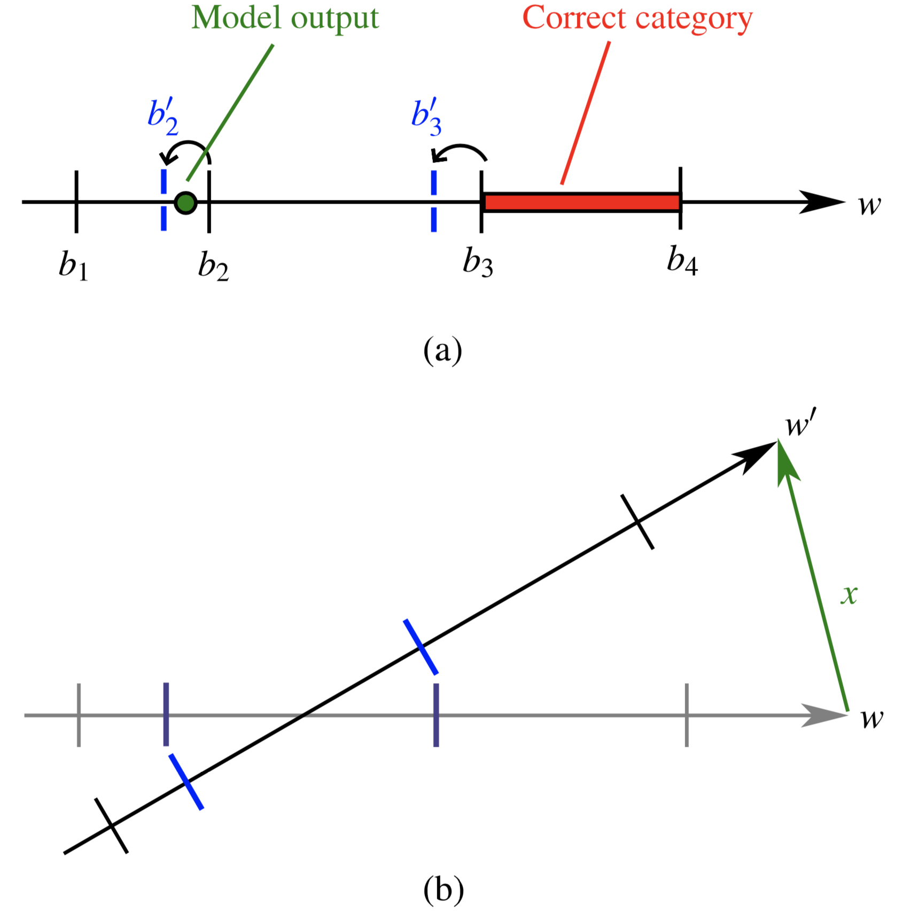
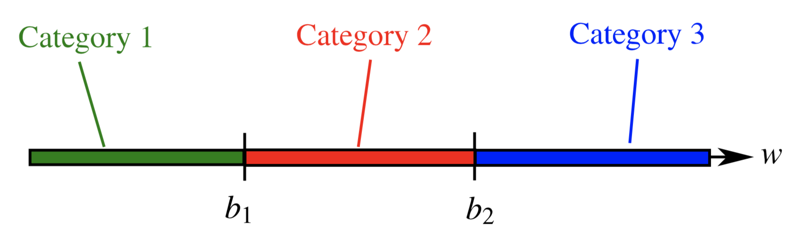

# 第二章 逐点方法

**摘要：**在本章中，我们介绍了学习排序的逐点方法。 具体来说，我们将介绍基于回归的算法，基于分类的算法和基于有序回归的算法，然后讨论它们的优缺点。

## 2.1 概述

当使用机器学习技术解决排序问题时，最直接的方法可能是检查是否可以直接应用现有的学习方法。这正是逐点方法所做的。在这样做时，我们假设要预测的是每个文档的确切相关程度，尽管在目标是生成文档的排名列表这个角度，这个预测可能并不一定是必要的。

根据所使用的不同机器学习技术，逐点方法可以进一步分为三个子类别：基于回归的算法，基于分类的算法和基于有序回归的算法。对于基于回归的算法，输出空间为实数值的相关性分数。对于基于分类的算法，输出空间为无序类别；对于基于有序回归的算法，输出空间为有序类别。

接下来，我们将在逐点方法的三个子类别中介绍代表性算法。

## 2.2 基于回归的算法

在这分支中，排名问题被简化为回归问题[5,8]。 回归是一种有监督的学习问题，在回归问题中，人们试图预测的目标变量是连续的。 在将排名正式化为回归时，人们将赋予文档的相关度视为连续变量，并通过最小化对训练集的损失来实现学习排序功能。 在这里，我们介绍一个代表性算法作为此子类别的示例。

图2.1 $y_j-f(x_j)$的平方损失函数

### 2.2.1 回归的子集排序

Cossock和Zhang[5]通过将排名降低为回归来解决排名问题。

给定$x=\{x_j\}_{j=1}^m$为一组与训练query有关的文档以及正确的标注$y=\{y_j\}_{j=1}^m$，这个正确的标注是对应文档的排序类别，假设有一个打分函数$f$能用于对其进行排序，损失函数可以被定义为下方平方损失。
$$
L(f;x_j,y_j)=(y_j-f(x_j))^2 \tag{2.1}
$$
平方损失函数曲线如图2.1所示。 从图中可以看出，当且仅当得分函数$f(x_j)$的输出与标签yj完全相等时，损失才为0。 否则，损失将以二次曲线形式增加。 换言之，对于相关文档，只有计分功能可以精确输出1时，损失才会为零。 否则，如果输出为2（似乎对于此文档的相关性甚至是更强的预测），都将会有一些损失。 从某种意义上说，这不是很合理。

进一步地，[5]提出了重要性加权回归模型。权重帮助新模型将更多的注意力集中在相关文档的回归误差上（更可能出现在排名结果的顶部）。 此外，还研究了将正则化项引入回归损失的效果，旨在使该方法更具泛化能力。

除了这些方法建议外，[5]还对使用平方损失函数进行了理论分析。 基本结论是，平方损失可以使基于NDCG的排名误差上限更高（有关更多详细信息，请参见第5章）。 然而根据以上讨论，即使存在较大的回归损失，相应的排序仍然能够符合正确标签所定义的内容，因为预测函数$f(xj)\ (j = 1，...，m)$所代表的相对排序会与正确标签所对应。所以，我们可以认为平方损失是基于NDCG的排名误差的宽松边界。

## 2.3 基于分类的算法

与将等级降低为回归的思路相似，也可以考虑将等级降低为分类问题。 分类是一种有监督的学习问题，在分类问题中人们试图预测的目标变量是离散的。 在将排名正式归类为分类时，人们会将对文档的相关程度视为类别标签。 在这里，我们介绍该子类别中的一些代表性算法。

### 2.3.1 二分类法排序

有几项工作研究了分类模型信息检索中的相关性排名的应用，例如[4，9]和[16]。 这里我们以[16]和[9]为例来说明基本思想。

**支持向量机方法（Support Vector Machine，SVM）** 给定文档$x=\{x_j\}_{j=1}^m$，以及他们与query $q$的二元相关性$y=\{y_j\}_{j=1}^m$，$y=1$表示文章和query并不相关，而$y=0$表示两者不相关，因此在当前情况下，此问题可以被看作二分类问题。

特别地，SVM[21、22]用于执行[16]中的分类任务。 将SVM应用于排名场景时的公式如下（此处假设我们用的是线性打分函数，例如$f(\omega,s)=\omega^Tx$）：
$$
min\frac{1}{2}||\omega||^2+\lambda\sum^n_{i=1}{\sum^{m^{(i)}}_{j=1}{\xi_{j}^{(i)}}}\\
s.t. \omega^T\leq-1+\xi_{j}^{(i)}, if \xi_{j}^{(i)}=0.\\
\omega^T\geq1-\xi_{j}^{(i)}, if \xi_{j}^{(i)}=1.\\
\xi_{j}^{(i)}\geq0, j=1,...,m^{(i)},i=1,...,n.\tag{2.2}
$$
其中$x_j^{(i)}$和$y_j^{(i)}$是指第$j$个文档以及其标注，这个标注表示与对应query $q_i$的相关性，$m^{(i)}$表示与query $q_i$的相关的文章的数量。

上述优化问题中的约束条件与每个训练文档$x_j^{(i)}$是否分类为正确的二元类相对应。 实际上，上述优化问题背后的损失函数是在每个文档上定义的Hinge损失。 例如，如果标签$y_j^{(i)}$为$+1$，并且模型输出$\xi_{j}^{(i)}$不小于$+1$，则该文档的损失为零。否则，损失将为$\xi_{j}^{(i)}$，通常称为软间隔项。 为了便于理解，我们在图2.2中绘制了Hinge损失曲线。

图2.2 Hinge作为$y_jf(x_j)$的损失函数

上述优化问题可以转化为对偶形式，并得到有效解决。 此外，可以使用核技巧将算法扩展到非线性情况（更多信息请参见第21和22章）。实验表明，基于SVM的算法可与语言模型媲美，有时甚至略胜于语言模型。 根据实验结果，SVM是首选，因为它能够自动学习任意特征，较少的假设和表达能力[16]。

**逻辑斯蒂回归方法（Logistic regression）**  在[9]中，它是一种流行的分类技术，用于执行二进制分类任务以进行排名。 首先，根据文档的特征，与文档$x_j$相关的概率的对数定义如下：
$$
log(\frac{P(R|x_j)}{1-P(R|x_j)})=c+\sum^T_{t=1}{\omega_tx_{j,t}} \tag{2.3}
$$
其中$c$是常数。

同理，将文档与查询相关的概率定义为如下形式。
$$
P(R|x_j)=\frac{1}{1+e^{-c-\sum^{T}_{t=1}{\omega_tx_{j,t}}}} \tag{2.4}
$$
给定一些训练数据，可以根据上式计算相关文档的可能性，并且可以通过极大似然估计法来估计参数$w_t$。 然后，这些参数可用于预测其他查询文档对的相对可能性。

具体地，在[9]中使用六个特征来构建模型，即，查询绝对频率，查询相对频率，文档绝对频率，文档相对频率，所有文档中的相对频率以及逆文档频率。 派生模型已在典型的Cranfield数据集上进行了测试，并被证明比常规向量空间模型要好得多。

### 2.3.2 多分类法排序

**提升树方法（Boosting Tree）** Li等[15]提出了使用多类分类来解决排名问题的方法。

给定文档$x=\{x_j\}_{j=1}^m$，以及他们与query $q$的相关性$y=\{y_j\}_{j=1}^m$，假设我们有一个多分类器，他能够根据$x_j$预测$\hat{y_j}$，然后将用于学习分类器的损失函数定义为以下0–1分类误差的替代函数：
$$
L(\hat{y_j},y_j)=I_{\{\hat{y_j}\neq{y_j}\}} \tag{2.5}
$$
实际上，上述分类误差的不同替代函数产生不同的损失函数，例如指数损失，Hinge损失和逻辑损失。 所有这些都可以用来学习分类器。 特别是，在[15]中，使用了以下替代损耗函数，并且采用了提升树算法来最小化损失函数。
$$
L_{\phi}(\hat{y_j},y_j)=\sum^m_{j=1}{\sum^{K}_{k=1}{-logP(\hat{y_j}=k)}I_{\{\hat{y_j}\neq{y_j}\}}}. \tag{2.6}
$$
特别地，分类器是一个加性模型，其参数为$\omega$，给定文档$x_j$，$F_k(x_j,\omega)$能够评估$x_j$属于类别$k$的程度。基于$F_k$，概率$P(\hat{y_j}=k)$能被定义为一个逻辑斯蒂回归函数。
$$
P(\hat{y_j}=k)=\frac{e^{F_k(x_j,\omega)}}{\sum^K_{s=1}{e^{F_k(x_j,\omega)}}} \tag{2.7}
$$
在测试过程中，将分类结果转换为排名分数。 特别地，使用（2.7）将分类器的输出转换为概率。 假设此概率为$P(\hat{y_j}=k)$，则使用以下加权组合确定文档的最终排名得分：
$$
f(x_j)=\sum^K_{k=1}{g(k)P(\hat{y_j}=k)} \tag{2.8}
$$
其中$g(·)$表示一个相关度的单调（递增）函数。

**关联规则挖掘方法** 当信息检索和机器学习领域的研究人员研究不同的学习排名算法时，数据挖掘研究人员也进行了一些尝试，将知名的数据挖掘算法应用于排名问题。 特别地，在[23]中，关联规则挖掘被用于执行用于学习排名的多类别分类。

[23]的基本思想是在训练数据中找到可以很好地表征属于类别$y$的文档的那些规则。 这样的规则$r$定义为具有一定取值范围的特征（表示为$F$，例如$BM25 = [0.56-0.70]$），支持度$support$以及置信度$confidence$。 $support$被定义为相关度为$y$的文档中包含特征$F$的比例，即$P(y,F)$。 $confidence$定义为在给定特征$F$的情况下存在关联度为$y$的文档的条件概率，即$p(y | F)$。 根据关联规则挖掘中的常规做法，只有那些支持度大于阈值$\sigma_{min}$且置信度也大于阈值$\theta_{min}$的规则才会最终被选择。 换句话说，关联规则挖掘的目的是最小化以下损失函数：
$$
-\sum_F{H(P(y,F),\sigma_{min})H(P(y|F),\theta_{min})} \tag{2.9}
$$
其中$H(a,b)$是一个分段函数，如果$a\geq b$ ，则为1，否则为0。

请注意，我们在这里学到的是一组规则，而不是评分函数$f$。 对于测试过程，它还不如应用$f$和根据其分数对文档进行排序那样简单。 相反，需要进行如下操作。 对于与测试查询关联的文档，如果规则$r$适用于该文档（即$P(y,F)>0$，,我们将累加其对应的置信度$P(y | F)$，然后执行归一化。
$$
\bar{\theta}(y)=\frac{\sum_{P(y,F)>0}P(y|F)}{\sum_{P(y,F)>0}1} \tag{2.10}
$$
然后，排名得分定义为关于不同相关度$y$的正则化累加置信度的线性组合，即
$$
s=\sum_y{y\frac{\bar{\theta}(y)}{\sum_y{\bar{\theta}(y)}}} \tag{2.11}
$$
最后，所有文档按照$s$的降序排序。

根据文献[23]的实验结果，上述方法具有很好的排名性能。另外指的注意的是，这项工作中使用的排名函数是高度非线性的，其差异在于具有相对更强的可解释性。

## 2.4 基于有序回归的算法

有序回归在学习排名模型时会考虑标注标签之间的顺序关系。

假设有$K$个有序类别。 有序回归的目标是找到一个评分函数$f$，使得可以使用阈值$b_1\leq b_2 \leq···\leq b_{K -1}$来区分评分函数的输出（即$f(x_j),j = 1,...,m$）为不同的有序类别。请注意，当我们将$K$设置为2时，有序回归自然会降为二元分类。 在这方面，基于有序回归的算法与基于分类的算法有很强的联系。另外有一些算法，例如[11，13]，在文献中也称为基于有序回归的算法。 但是，根据我们的分类，它们属于成对方法，因为它们实际上并不关心将文档准确分配给有序类别之一。 相反，他们更多地关注两个文档之间的相对顺序。

在文献中，此子类别中有几种方法，例如[1、3、6、20]和[2]。 我们将介绍其中一些如下。

### 2.4.1 基于感知机的排序（Perceptron-Based Ranking (PRanking)）

PRanking是关于有序回归的著名算法[6]。 PRanking的目标是在投影文档之后找到由参数向量w定义的方向，在文档上可以轻松地使用阈值将文档区分为不同的有序类别。

该目标是通过迭代学习过程实现的。 在迭代$t$上，学习算法获取与查询$q$关联的实例$x_j$。 给定$x_j$，该算法预测$\hat{y_j} = argmin_k\{w^Tx_j−b_k<0\}$。 然后，它接收标注标签yj。 如果算法出错（即$\hat{y_j} \neq y_j$），则至少存在一个以$k$为索引的阈值，因为$w^Tx_j$的值位于$b_k$的错误一侧。 要纠正该错误，我们需要将$w^Tx_j$和$b_k$的值彼此相对移动。 例子如图2.3所示。 之后，就像许多基于感知器的算法一样，通过$\omega = \omega + x_j$来调整模型参数$\omega$。 重复此过程，直到训练过程收敛。

图2.3 PRanking的学习过程

Harrington [10]随后提出使用集成学习来进一步提高PRanking的性能。首先对训练数据进行二次采样，然后使用每个样本学习PRanking模型。 之后，将与模型关联的权重和阈值取平均值以生成最终模型。 已经证明以这种方式能有更强的泛化能力。

### 2.4.2 基于最大化边际原则的排序

Shashua和Levin [20]尝试使用SVM技术来学习模型参数$\omega$和阈值$b_k(k=1,...,K)$的正态回归。

具体地，分为两种策略。 第一个称为固定边界策略。

给定训练查询$\{q_j\}_{j=1}^n$以及与他关联的的文档$x^{(i)}=\{x_j^{(i)}\}_{j=1}^{m^{(i)}}$，还有相关性$y^{(i)}=\{y_j^{(i)}\}_{j=1}^{m^{(i)}}$，假设采用线性评分函数，学习过程定义如下。约束基本上要求每个文档的正确分类是目标有序类别，即对每个类别$k$，$w^Tx_j^{(i)}$应该超过阈值$b_{k-1}$但是小于阈值$b_k$，分别有一定的边界（例如，$1-\xi_{j,k-1}^{(i)*}$和$1-\xi_{j,k}^{(i)*}$），如图2.4所示。

$$
min\frac{1}{2}||\omega||^2+\lambda\sum^n_{i=1}{\sum^{m^{(i)}}_{j=1}{
\sum^{K-1}_{k=1}(\xi_{j,k}^{(i)}+\xi_{j,k+1}^{(i)*})}}\\
s.t. w^Tx_j^{(i)}-b_k \leq -1+\xi_{j,k}^{(i)}, if\ y_j^{(i)}=k, \\
w^Tx_j^{(i)}-b_k \geq 1-\xi_{j,k+1}^{(i)*}, if\ y_j^{(i)}=k+1, \\
\xi_{j,k}^{(i)}\geq0, \ \xi_{j,k+1}^{(i)*}\geq0, \\
j=1,...,m^{(i)},\ i=1,...,n,\ ,k=1,...,K-1.
\tag{2.12}
$$
第二个策略被称为累计边界策略。在这个策略中，有加性的阈值$a_k$被引入，而对于类别$k$，$b_k$是下界，$a_k$是上界，因此约束变为对类别$k$，$w^Tx_j^{(i)}$要在$b_{k-1}$和$a_k$之间，即在特定的范围下（例如，$1-\xi_{j,k-1}^{(i)*}$和$1-\xi_{j,k}^{(i)*}$）。学习过程如下，从这个学习过程我们能够看到边界项$\sum^K_{k=1}{(a_k-b_k)}$才真正是边界的含义，如图2.5所示，$(b_k-a_k)$正好是类别$k$和$k-1$两者的间隙。

图2.5 累计边界策略
$$
min\frac{1}{2}||\omega||^2+\lambda\sum^n_{i=1}{\sum^{m^{(i)}}_{j=1}{
\sum^{K-1}_{k=1}(\xi_{j,k}^{(i)}+\xi_{j,k+1}^{(i)*})}}\\
s.t. a_k \leq b_k \leq a_k+1, \\
w^Tx_j^{(i)} \leq a_k+\xi_{j,k}^{(i)}, if\ y_j^{(i)}=k, \\
w^Tx_j^{(i)} \geq b_k-\xi_{j,k+1}^{(i)*}, if\ y_j^{(i)}=k+1, \\
||\omega||^2 \leq 1, \ \xi_{j,k}^{(i)*} \geq0, \ \xi_{j,k+1}^{(i)*}\geq0, \\
j=1,...,m^{(i)},\ i=1,...,n,\ ,k=1,...,K-1.
\tag{2.13}
$$
理想地，在上述方法中，一个要求$b_k(k=1,...,K-1)$在一个递增的序列中($b_{k-1}\leq b_k$)，但是，实际上，由于在优化问题中对阈值没有明确的限制，因此学习过程不能始终保证这一点。 为了解决这个问题，Chu and Keerthi [3]在阈值上添加显式或隐式约束。 显式约束简单地采取$b_{k-1}\leq b_k$的形式，而隐式约束使用冗余训练示例来保证阈值之间的顺序关系。

### 2.4.3 基于阈值损失函数的有序回归

在[18]中，比较了有序回归的不同损失函数，研究了两种基于阈值的损失函数，即立即阈值损失和全阈值损失，此处，阈值是指将不同的有序类别区分开的$b_k(k = 1,...,K-1)$。

假设评分函数是$f(x)$，而$\phi$是边际罚函数。 $\phi$可以是Hinge，指数，逻辑或平方函数。 然后，立即阈值损失定义如下：
$$
L(f;x_j,y_j)=\phi(f(x_j)-b_{y_j-1})+\phi(b_{y_j}-f(x_j)) \tag{2.14}
$$
其对每个样本，$(x_j,y_j)$，只有两个阈值（被定义为“正确的细分”）$(b_{y_j-1},b_{y_j})$是被关心的。

对于全阈值的损失被定义如下，这是所有违反阈值的惩罚之和。

