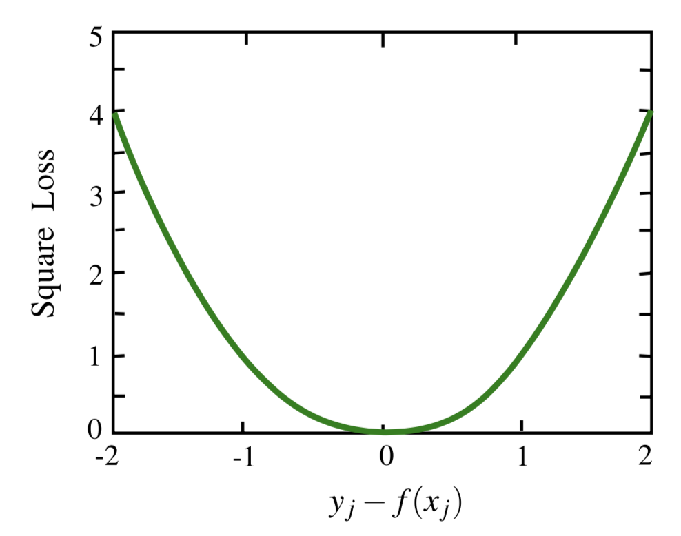

# 第二章 逐点方法

**摘要：**在本章中，我们介绍了学习排序的逐点方法。 具体来说，我们将介绍基于回归的算法，基于分类的算法和基于序数回归的算法，然后讨论它们的优缺点。

## 2.1 概述

当使用机器学习技术解决排序问题时，最直接的方法可能是检查是否可以直接应用现有的学习方法。这正是逐点方法所做的。在这样做时，我们假设要预测的是每个文档的确切相关程度，尽管在目标是生成文档的排名列表这个角度，这个预测可能并不一定是必要的。

根据所使用的不同机器学习技术，逐点方法可以进一步分为三个子类别：基于回归的算法，基于分类的算法和基于有序回归的算法。对于基于回归的算法，输出空间为实数值的相关性分数。对于基于分类的算法，输出空间为无序类别；对于基于序数回归的算法，输出空间为有序类别。

接下来，我们将在逐点方法的三个子类别中介绍代表性算法。

## 2.2 基于回归的算法

在这分支中，排名问题被简化为回归问题[5,8]。 回归是一种有监督的学习问题，在回归问题中，人们试图预测的目标变量是连续的。 在将排名正式化为回归时，人们将赋予文档的相关度视为连续变量，并通过最小化对训练集的损失来实现学习排序功能。 在这里，我们介绍一个代表性算法作为此子类别的示例。

图2.1 $y_j-f(x_j)$的平方损失函数

### 2.2.1 回归的子集排名

Cossock和Zhang[5]通过将排名降低为回归来解决排名问题。

给定$x=\{x_j\}_{j=1}^m$为一组与训练query有关的文档以及正确的标注$y=\{y_j\}_{j=1}^m$，这个正确的标注是对应文档的排序类别，假设有一个打分函数$f$能用于对其进行排序，损失函数可以被定义为下方平方损失。
$$
L(f;x_j,y_j)=(y_j-f(x_j))^2 \tag{2.1}
$$
平方损失函数曲线如图2.1所示。 从图中可以看出，当且仅当得分函数$f(x_j)$的输出与标签yj完全相等时，损失才为0。 否则，损失将以二次曲线形式增加。 换言之，对于相关文档，只有计分功能可以精确输出1时，损失才会为零。 否则，如果输出为2（似乎对于此文档的相关性甚至是更强的预测），都将会有一些损失。 从某种意义上说，这不是很合理。

进一步地，[5]提出了重要性加权回归模型。权重帮助新模型将更多的注意力集中在相关文档的回归误差上（更可能出现在排名结果的顶部）。 此外，还研究了将正则化项引入回归损失的效果，旨在使该方法更具泛化能力。

除了这些方法建议外，[5]还对使用平方损失函数进行了理论分析。 基本结论是，平方损失可以使基于NDCG的排名误差上限更高（有关更多详细信息，请参见第5章）。 然而根据以上讨论，即使存在较大的回归损失，相应的排序仍然能够符合正确标签所定义的内容，因为预测函数$f(xj)\ (j = 1，...，m)$所代表的相对排序会与正确标签所对应。所以，我们可以认为平方损失是基于NDCG的排名误差的宽松边界。