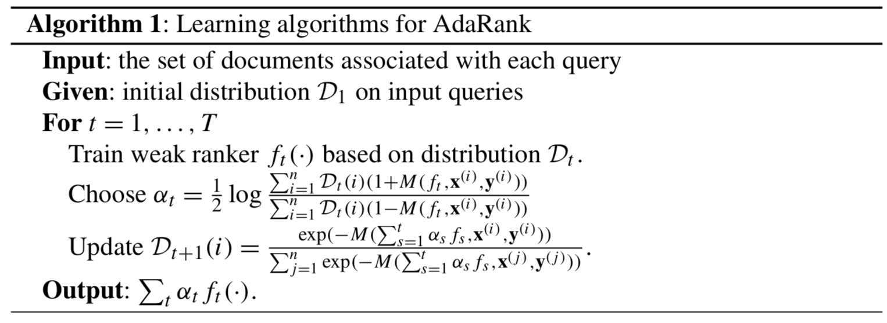

# 第四章 基于列表的方法

**摘要：**在本章中，我们介绍了基于列表的学习排名方法。 具体来说，我们首先介绍那些最小化特定度量的损失函数的基于列表的算法（也称为直接优化方法），然后介绍一些损失函数与评估方法不直接相关的的其他信息检索算法。

## 4.1 概述

基于列表的方法将与训练数据中的查询相关联的整个文档集作为输入，并预测其标注标签。 根据使用的损失函数，该方法可以分为两个子类别。 第一个子类别的损失函数与评估度量明确相关（例如，基于度量的排名误差的近似值或上限）。 示例算法包括[5、7、25、27、32-34、36、37]。 由于损失函数和评估指标之间的密切关系，这些算法也被称为直接优化方法。 第二个子类别的损失函数与评估指标没有明确关系。 示例算法包括[4，16，30，31]。 在本章的其余部分，我们将介绍这两个子类别及其代表算法。

请注意，基于列表的方法假设根据排列给出正确的标注标签，但是判断排列可能采用其他形式（例如关联度或成对偏好）。 在这种情况下，我们将使用等效置换集的概念（表示为$\Omega_y$，请参见第1章）来弥合差距。 对于$\Omega_y$，我们使用$L(f;x,\Omega_y)$表示基于列表的方法的损失函数。 但是，为了便于讨论，如果根据每个单个文档的相关度是由$\Omega_y$生成，有时会将损失函数写为$L(f;x,y)$。

此外，诸如MAP和NDCG的评估方法也可以以$\Omega_y$的形式重写。 例如，我们可以如下重写NDCG：
$$
NDCG(\pi, \Omega_y)=\frac{1}{Z_m}\sum_{j=1}^{m}{G(l_{\pi^{-1}(\pi_y(j))})\eta(\pi_y(j))}, \ \forall\pi_y\in\omega_y \tag{4.1}
$$
同样，为了便于讨论，有时我们也将NDCG写为$NDCG(\pi,y)$或$NDCG(f,x,y)$（当$\pi=sort\ \circ\ f(x)$时）。

## 4.2 最小化度量损失

通过直接优化用于评估排名表现的内容来学习排序模型可能是最直接的选择。这正是基于列表的方法的第一个子类别的动机，即直接优化方法。但是，这项任务并不像看起来那么琐碎。如前所述，诸如NDCG和MAP之类的评估指标都是基于位置的，因此是不连续且不可微的[26，33]。优化此类目标函数的困难源于以下事实：大多数现有的优化技术都是为处理连续和可区分的情况而开发的。

为了应对挑战，已经进行了几次尝试。首先，可以选择优化基于量度的排名误差的连续可微近似。这样，可以利用许多现有的优化技术，示例算法包括SoftRank [27]，Approximate Rank [25]和SmoothRank [7]。第二，可以用优化一个连续可微的边界函数（有时甚至是凸的）来替代度量排序误差，示例算法包括SVMmap [36]，SVMndcg [5]和PermuRank [33]（实际上，此技巧也已用于分类。 也就是说，由于0-1分类损失是不可微的，因此使用了像指数损失这样的凸上限。）。第三，可以选择使用能够优化非平滑目标的优化技术。例如，可以为利用Boosting框架（相应的算法称为AdaRank [32]），或采用遗传算法进行优化（相应的算法称为RankGP [34]）。

### 4.2.1 度量近似

#### 4.2.1.1 SoftRank

在SoftRank [27]中，假定不是简单地通过根据评分功能进行排序来确定文档的排名。 取而代之的是，它通过将文档的实际分数视为随机变量来将随机性引入排序过程，该随机变量的均值是评分函数给出的分数。 这样，文档很可能可以在任何位置排名，当然也会具有不同的概率。 对于每个这样的可能排名，可以计算NDCG值。 然后，可以将NDCG对所有可能排名的期望用作原始评估指标NDCG的平滑近似。 实现此目标的详细步骤如下。

首先，定义分数分布。 给定$x=\{x_j\}_{j=1}^m$与训练查询$q$相关联，文档$x_j$的分数$s_j$不再是确定性值，而是随机变量。 随机变量由高斯分布控制，其方差为$\sigma_s$，平均值为$f(x_j)$，即得分函数输出的原始得分。 于是有
$$
p(s_j)=N(s_j|f(x_j), \sigma_x^2) \tag{4.2}
$$
第二，定义排序分布。 由于分数的随机性，每个文档都有可能在任何位置排名。具体地，基于得分分布，可以推论出文档$x_u$被排在另一个文档$x_v$之前的概率如下：
$$
P_{u,v}=\int_0^\infty{N(s|f(x_u)-f(x_v),2\sigma_s^2)}ds \tag{4.3}
$$
在此基础上，可以通过将文档一个接一个地添加到排名列表中，以迭代方式得出排名分布。 假设我们已经在排名列表中包含文档$x_j$，则在添加文档$x_u$时，如果文档$x_u$可以击败$x_jj$，则$x_j$的排名将增加1。 否则，$x_j$的等级将保持不变。 在数学上，可以将$x_j$排在位置$r$上的概率（表示为$P_j(r)$）计算如下：
$$
P_j^{(u)}(r)=P_j^{(u-1)}(r-1)P_{u,j}+P_j^{(u-1)}(r)(1-P_{u,j}) \tag{4.4}
$$
第三，利用等级分布，可以计算NDCG的期望值（称为SoftNDCG（为了便于参考，我们还将诸如SoftNDCG的目标函数称为替代指标。）），并在学习排序时使用$(1- SoftNDCG)$作为损失函数：
$$
L(f;x,y)=1-\frac{1}{Z_m}\sum_{j=1}^m{(2^{y_j}-1)}\sum_{r=1}^m{P_j(r)} \tag{4.5}
$$
为了通过最小化上述损失函数来学习排序模型$f$，可以使用神经网络作为模型，并采用梯度下降作为优化算法。

在[14]中，高斯过程用于进一步增强SoftRank算法，其中$\sigma_s$不再是预先指定的常数，而是学习的参数。 在[35]中，SoftRank方法进一步扩展为近似P@k和AP。相应的目标函数分别命名为SoftPC和SoftAP。

#### 4.2.1.2 排序的决策理论框架

在[37]中，提出了与SoftRank类似的想法，该想法使用决策理论框架来优化预期的评估措施。 首先，定义排序实例。 例如，实例可以是任何评估指标。 假设效用表示为$U(·)$，则将以下期望效用作为学习目标：
$$
\tilde{U}(w;x,y)=E_{p(s|X,w)}[U(s,y)] \tag{4.6}
$$
其中$w$表示排序函数的参数，而$s$是文档的排序分数。

根据以上定义，尽管实例本身可能是不连续不可微的，但它不包含任何模型参数，也不会给学习过程带来麻烦，实际上包含模型参数的是条件概率$p(s|x,w)$。

在[37]中，假设文档之间的独立性（即，$p(s|x,w)=\Pi_jp(s_j|x_j,w)$，并且使用广义线性模型[22]来定义$p(s_j|x_j,w)p$，每个单个文档的条件概率。 广义线性模型包括似然模型$p(y |\theta)$，输入和模型参数的线性组合$w^Tx$以及将参数$\theta$映射到实线的链接函数。 特别地，在[37]中将二项式函数（即$Bin(·)$）用作似然模型，并使用累积正态函数（即$\psi(·)$）来定义
概率链接功能：
$$
p(s_j|X,w)=Bin(s_j;\psi(w^Tx;0,\frac{1}{\pi}),m) \tag{4.7}
$$
其中$m$是文档的数量。

然后，该算法使期望效用最大化（等效地，负效用可以视为损失函数）。 特别地，使用具有分解高斯先验的近似贝叶斯推断[18]来学习模型参数。

注意，除了优化评估方法之外，决策理论框架还可以用于优化其他实例，例如，用户单击文档的可能性。

#### 4.2.1.3 近似排序

在[25]中，Qin等人指出评估方法不佳的根本原因是排序位置相对于等级分数不好。 因此，他们建议使用排序分数的平滑函数对排名位置进行近似计算，从而使近似评估方法变得可区分且更易于优化。

这里我们以NDCG为例来说明近似过程。 同样的想法也适用于MAP。 有关更多详细信息，请参阅[25]。

如果将NDCG定义中的累计索引（请参见第1章）从排位结果中的位置更改为文档的索引，则NDCG可以重写为：
$$
Z_m^{-1}\sum_j{\frac{G(y_j)}{log(1+\pi(x_j))}} \tag{4.8}
$$
其中$\pi(x_j)$是文档$x_j$在排序结果$\pi$中的位置，他可以这么计算：
$$
\pi(x_j)=1+\sum_{u\neq j}{I_{\{f{x_j}-f{x_u}<0\}}} \tag{4.9}
$$
请注意，尽管此处的贴现函数$\eta(r)$有很多可靠的表达方式，此处我们可以直接定义$\eta(r)=\frac{1}{log(1+r)}$是为了简化。

从式（4.9）中，可以清楚地看到NDCG的非平滑特性来自何处。 实际上，NDCG是排名位置的平滑函数，但是，由于指标函数，排名位置是排名分数的非平滑函数。

[25]中的关键思想是通过S型函数[4]来近似指标函数，以便可以通过排名分数的平滑函数来近似位置。请注意，sigmoid函数是是一族函数，如广泛使用的逻辑函数，其他族成员包括普通的反正切函数，双曲正切函数和误差函数。 这里以逻辑函数为例。
$$
\hat{\pi}(x_j)=1+\sum_{u\neq j}{\frac{exp(-\alpha(f(x_j)-f(x_u)))}{1+exp(-\alpha(f(x_j)-f(x_u)))}} \tag{4.10}
$$
其中$\alpha>0$是一个比例常数。

通过（4.8）替换$\pi(x_j)$到$\hat{\pi}(x_j)$，可以得到NDCG的近似值（表示为AppNDCG），然后将损失函数定义为$(1-AppNDCG)$，
$$
L(f;x,y)=1-Z_m^{-1}\sum_{j=1}^m{\frac{G(y_j)}{log(1+\hat{\pi}(x_j))}} \tag{4.11}
$$
由于这种损失函数是连续的，并且相对于评分函数是微分的，因此可以简单地使用梯度下降法将其最小化。

在[25]中分析了近似精度。 基本结论是，当$\alpha$设置得足够大时，近似值可以变得非常准确。 换句话说，如果可以找到预期的损失函数的最优值，那么很可能也可以得到NDCG的最优值。

请注意，近似值越精确，损失函数就越“不平滑”。 相应地，优化过程变得不那么健壮。 通常需要采用一些鲁棒的优化算法，例如模拟退火或随机优化，以确保找到针对优化问题的良好解决方案。

#### 4.2.1.4 SmoothRank

在[7]中，提出了与近似等级相似的想法，即通过近似排名位置来平滑评估测量，两者轻微的区别在于定义逼近器的方式和执行优化的方式。

同样，这里我们以NDCG为例进行说明。 请注意，相同的想法也适用于MAP和许多其他评估措施。

在[7]中，通过使用文档的索引和排名结果中的位置来重写NDCG：
$$
\sum_{j=1}^m{\sum_{u=1}^m{G(y_{\pi^{-1}(u)})\eta(u)I_{x_j=x_{\pi}-l_{(u)}}}} \tag{4.12}
$$
其中$I_{x_j=x_{\pi}-l_{(u)}}$表示文档$x_j$是否在排序的第$u$个位置。

然后使用下列函数对$I_{x_j=x_{\pi}-l_{(u)}}$进行了平滑。
$$
h_{ju}=\frac{e^{-(f(x_j)-f(x_{\pi^{-1}(u)}))^2/\sigma}}{\sum_{l=1}^me^{-(f(x_j)-f(x_{\pi^{-1}(u)}))^2/\sigma}} \tag{4.13}
$$
有了$h_{ju}$，就可以得到NDCG的平滑版本，并在其基础上定义损失函数：
$$
\begin{align*}
L(f;x,y)&=1-\sum_{j=1}^m{\sum_{u=1}^m{G(y_{\pi^{-1}(u)})\eta(u)}h_{ju}} \\
&=1-\sum_{j=1}^m{\sum_{u=1}^m{G(y_{\pi^{-1}(u)})\eta(u)\frac{e^{-(f(x_j)-f(x_{\pi^{-1}(u)}))^2/\sigma}}{\sum_{l=1}^me^{-(f(x_j)-f(x_{\pi^{-1}(u)}))^2/\sigma}}}}
\end{align*}
\tag{4.14}
$$
显然，$h_{ju}$是得分函数$f$的连续函数，上述损失函数也是如此。 因此，可以使用梯度下降法对其进行优化。

与关于近似排序的讨论类似，平滑参数$\sigma$的选择也很关键：一方面，如果它很小，则目标函数将非常接近原始评估指标，因此高度不平滑且难以优化，而如果目标函数较大，则目标函数是平滑且易于优化的，但与相应的评估方法有很大不同。在[7]中，使用确定性退火策略来辅助优化。此过程可以看作是构造一系列函数的同伦方法：第一个函数易于优化，最后一个是期望的函数，中间的每个函数都可以看作是前一个函数的变形函数。 同伦方法从先前函数开始一个接着一个最小化系列内的每个函数，特别地，变形受$\simga$控制，从大$\sigma$开始，逐步最小化越来越小的$\simga$对应的函数。

### 4.2.2 边界优化

#### 4.2.2.1 $SVM^{map}$

$SVM^{map}$[36]使用结构化支持向量机[17，29]的框架来优化评估指标AP。

假设$x=\{{x_j}\}_{j=1}^m$代表所有与query $q$ 的文档，（如果$x_j$与query相关，则$y_j=1$，否则$y_j=0$），表示相应的标准标签。$y^c$表示所有错误指标，$SVM^{map}$可以用下面形式表示。
$$
\begin{align*}
&min \frac{1}{2}||\omega||^2+\frac{\lambda}{n}\sum_{j=1}^{n}{\xi^{(i)}} \\
s.t.\ \ \  &\forall y^{c(i)}\neq y^{(i)}, \\
&\omega^T\Psi(y^{(i)},x^{(i)})\geq \omega^T\Psi(y^{c(i)},x^{(i)})+1-AP(y^{c(i)}, y^{(i)})-\xi^{(i)}
\end{align*}
\tag{4.15}
$$
此处$\Psi$表示的是被称为联合特征图，定义如下：
$$
\Psi(y,x)=\sum_{u,v;y_u=1,y_v=0}(x_u-x_v) \tag{4.16}
$$

$$
\Psi(y^c,x)=\sum_{u,v;y_u=1,y_v=0}(y_u^c-y_v^c)(x_u-x_v) \tag{4.17}
$$

已经证明，$SVM^{map}$中的松弛总和可以从上方限制$(1-AP)$。 因此，如果能够有效解决上述优化问题，则AP会相应地最大化。 但是，文档的不正确标签数量呈指数级增长，因此，优化问题对每个查询都有大量的约束条件，因此，直接解决这种优化问题是很大的挑战。 为了解决这一难题，在[36]中使用了主动集方法。 也就是说，将维护一个工作集，该工作集仅包含那些违反程度最大的约束（在下面定义），并且仅针对该工作集执行优化。
$$
Violation \triangleq 1-AP(y^{c}, y)+\omega^T\Psi(y^c,x) \tag{4.18}
$$
然后，就能获得对给定得分函数$f(x)=\omega^Tx$的最违反约束。此时AP的特性就被考虑了。 也就是说，如果每个位置的相关性固定，则无论哪个文档出现在该位置，AP都将相同。 因此，可以设计找到最违反约束条件的有效策略[36]，其时间复杂度仅为$O(mlogm)$，其中$m$是与qyery $q$ 相关的文档数。

在[5、6、19]中，$$SVM^{map}$$被进一步扩展，在其他指标上进行了尝试。 当目标评估指标为NDCG和MRR时，所得算法称为$SVM^{ndcg}$和$SVM^{mrr}$。 基本上在这些扩展中都使用了不同的特征图或不同的策略来搜索违反最严重的约束，但是关键思想仍然与$SVM^{map}$相同。

文献[33]中的进一步分析表明，上述工作中的损失函数实际上是以下数量的凸上限，而该数量是相应的基于度量的排名误差的上限。
$$
\max\limits_{y^c\neq y}(1-M(y^c,y))I_{\omega^T\Psi(y,x)\leq \omega^T\Psi(y^c,x)} \tag{4.19}
$$
其中$M(y^c,y)$表示当排名结果为$y^c$且实际标签为$y$时评估度量$M$的值。

在[5、6、19、36]中，上述数量的以下凸上限被最小化：
$$
\max\limits_{y^c\neq y}[(1-M(y^c,y))+\omega^T\Psi(y^c,x)-\omega^T\Psi(y,x)]_+ \tag{4.20}
$$
在另一种称为PermuRank [33]的方法中，在优化过程中采用了与上述公式的不同凸上限，如下所示。
$$
\max\limits_{y^c\neq y}(1-M(y^c,y))[1-\omega^T\Psi(y,x)+\omega^T\Psi(y^c,x)]_+ \tag{4.21}
$$

### 4.2.3 非平滑优化

与前两个小节介绍的方法不同，还有其他一些方法可以使用非平滑优化技术直接优化评估指标。 例如，在AdaRank [32]中，使用了增强算法来优化评估度量的指数函数。 请注意，由于指数函数是单调的，因此AdaRank中目标函数的优化等同于评估度量本身的优化。再举一个例子，在RankGP [34]中，评估方法被用作遗传算法的适应度函数。

应该注意的是，尽管这些非平滑优化技术非常通用并且可以处理任何非平滑函数的优化，但它们也有其局限性，换言之，尽管将评估方法直接用作目标函数，但不能保证人们能够真正找到其最佳选择。

#### 4.2.3.1 AdaRank

算法1：AdaRank

Xu和Li [32]指出可以将评估方法插入Boosting的框架中，并进行有效的优化。此过程不需要评价指标是连续且可区分的，该结果算法称为AdaRank。

众所周知，在传统的AdaBoost算法中，指数损失被用于更新输入对象的分布并确定每轮迭代中弱学习者的组合系数（请参阅第21和22章）。在AdaRank中，评价指标被用于更新查询的分布并计算弱排名的组合系数。 算法1中显示了算法流程，其中$M(f,x,y)$表示评估指标。 由于类似于AdaBoost，AdaRank可以专注于那些困难的查询，并逐步将$1 − M(f,x,y)$最小化。

训练过程收敛的条件在[32]中给出，其推导技术与AdaBoost相似。条件要求$|M(\sum{^t_{s=1}{\alpha_sf_s,x,y}})-M(\sum{^{t-1}_{s=1}{\alpha_sf_s,x,y}})-\alpha_tM(f_t,x,y)|$非常小，这意味着假设作为$f_t$的函数的评价指标$M$是ix安兴的。 但是，在实践中可能无法很好地满足此假设。 因此，AdaRank的训练过程可能无法自然收敛，并且需要一些其他的停止标准。

#### 4.2.3.2 基于遗传规划的算法

遗传规划设计是一种用于优化复杂目标的方法。 在学习排序的文献中，曾有几次尝试使用遗传规划来优化评估方法。 代表性算法包括[1，8–13，28，34]。

在这里，我们以RankGP [34]的算法为例，说明如何使用遗传规划来学习排序模型。在该算法中，排序模型被定义为一棵树，其叶节点是特征或常数，非叶节点是诸如+，-，×，÷的运算符（见图4.1）。 然后，使用单种群遗传编程在树上进行学习。 交叉，变异，繁殖和比赛选择被用作进化机制，评估手段被用作适应度函数。

图4.1 RankGP中的排序函数

### 4.2.4 讨论

从上述示例可以看出，目前已经有各种方法来优化与评价指标有关的损失函数。实际上，还有更多这样的工作，由于空间限制，这些工作没有被详细介绍，例如[23，26]。

除了这些工作之外，在[35]中讨论了评价指标是否适合直接优化。为此，提出了一种称为信息量的概念。实证研究表明，更多的信息量可以导出更有效的排名模型，进而讨论为什么一些指标提供更多信息而另一些措施却没有那么多。具体而言，根据讨论，多级度量（例如NDCG）比二进制度量（例如AP）更具信息性，因为它们可以响应不同相关度文档之间的任何翻转。此外，给定两个二进制（或多级）度量，出于以下原因，一种度量可能仍比另一种度量更具信息性：（1）有些度量通常仅对排名中某些特定部分的翻转做出响应顶端； （2）即使两个度量取决于排名的同一部分，由于忽略某些翻转或所使用的折现函数，对于该部分内的某些翻转，一个度量可能也不敏感。

几种直接优化方法的实验验证了以上讨论，作为一个有趣的结果，即使最终将其用于评估，优化信息量较小的方法也不总是最佳选择。例如，与直接优化P@10相比，直接优化AP可以带来更好的P@10排序性能。

## 4.3 最小化非特定指标的损失函数

在基于列表方法的第二个子类别中，设计了不是限定在特定指标的损失函数，这种损失函数反映了排名模型的输出与标准标签之间的不一致，尽管此处没有直接优化评估方法，但是如果在损失函数的设计中可以考虑信息检索中排名的不同属性，则仍然可以学习在评估方法方面具有良好的性能的模型。

此子类别中的示例算法包括ListNet [4]，ListMLE [31]，StructRank [16]和BoltzRank [30]。 我们将在本节中对其进行介绍。

### 4.3.1 ListNet

在ListNet [4]中，损失函数是使用排列的概率分布定义的。

实际上，在概率论领域中已经很好地研究了有关排列的概率分布。 已经提出了许多著名的表示排列概率分布的模型，例如Plackett-Luce模型[20，24]和Mallows模型[21]。 由于排列与排名列表具有自然的一对一对应关系，因此这些研究可以自然地应用于排名。 ListNet [4]就是这样一个例子，展示了如何将Plackett-Luce模型应用于学习排名。

给定打分函数输出的文档的排名分数函数$f$（例如$s=\{s_j\}^m_{j=1}$，其中$s_j=f(x_j)$），Plackett-Luce模型根据链式规则为文档的每个可能排列$pi$定义概率，如下所示：
$$
P(\pi|s)=\prod_{j=1}^m{\frac{\psi(s_{\pi^{-1}(j)})}{\sum_{u=1}^m{\psi(s_{\pi^{-1}(u)})}}} \tag{4.22}
$$
其中$\pi^{-1}$表示位于排列$\pi$的第$j$个位置的文档，并且$\psi$是转换函数，可以是线性，指数或S型。

请注意，在某些情况下，Plackett-Luce模型是尺度不变的，而平移不变的。 例如，当我们使用指数函数作为变换函数时，将相同的常数添加到所有排名分数后，Plackett-Luce模型定义的排列概率分布将不会改变。 当我们使用线性函数作为变换函数时，将所有排名得分乘以相同的常数后，排列概率分布将不会改变。 这些属性完全符合我们对排名的直觉。

使用Plackett-Luce模型，对于给定的查询$q$，ListNet首先根据评分函数$f$给出的排序概率分布。然后，它基于标签定义另一个排列概率分布$P_y(\pi)$。例如，如果将标签作为关联度给出，则可以将其直接替换为Plackett-Luce模型以获得概率分布。当标签作为排列$\pi_y$（或拍续集集$\Omega y$）给出时，可以将$P_y(\pi)$定义为增量函数，该函数仅对该排列（或集合中的排列）取值为1，然后取所有其他排列的值为0。还可以首先使用一种映射函数将标签排列中的位置映射到真实分数，然后使用（4.22）计算概率分布。此外，还可以选择使用Mallows模型[21]，通过将标签排列作为模型中的质心来定义$P_y(\pi)$。

下一步，ListNet使用排名模型的概率分布与地面事实的概率分布之间的K-L散度定义其损失函数（简称为K-L散度损失）。
$$
L(f;x,y)=D(P_y(\pi)|P_y(\pi|f(\omega,x))) \tag{4.23}
$$
在[31]中已经证明上述K-L散度损失函数是凸的，因此可以使用一种简单的梯度下降方法来获得其全局最优值。如[4]所示，ListNet的训练曲线很好地证明了K-L散度损失与$1-NDCG@5$之间的相关性，尽管损失与NDCG没有明显关系。

可能已经注意到，ListNet算法存在一个计算问题。尽管由于使用了评分函数来定义假设，但ListNet的测试复杂度可以与逐点方法和成对的方法相同，但是ListNet的训练复杂度却更高。训练复杂度为$m$的指数级（因此在实践中很难处理），因为对每个查询$q$的K-L散度损失的评估需要添加$m$阶乘项。相对而言，逐点和成对方法的训练复杂度大致与文档数（即$O(m)$）和文档对数（即$O(\tilde{m})$）成正比。为了解决这个问题，在[4]中进一步引入了KL散度损失的top-k版本，它基于top-k Plackett-Luce模型，可以将训练复杂度从m的指数级降低到多项式级。

### 4.3.2 ListMLE

即使使用了top-k的K-L散度损失，仍然无法避免ListNet的以下局限性。 当k设置为大时，评估K-L发散损耗的时间复杂度仍然很高。 但是，如果将k设置为较小，则有关排列的信息将大量丢失，并且ListNet算法的有效性也无法得到保证[4]。

为了解决这个问题，提出了一种名为ListMLE的新算法[31]。 ListMLE也基于Plackett-Luce模型。 对于每个查询$q$，用打分函数的输出定义排列概率分布时，它使用基本实数排列的负对数似然作为损失函数（请注意，也可以使用top-k Plackett-Luce模型来定义似然损失。 但是，在这种情况下，其目的不是降低计算复杂度，而是更好地反映实际排名要求。）。我们将此新损失函数表示为简称为似然损失 ：
$$
L(f;x,y)=-log \ P(\pi_y|f(\omega,x)) \tag{4.24}
$$
显然，与ListNet相比，这种方式可以大大降低了训练的复杂性，因为只需要计算单个排列$pi_y$的概率，而不是全部排列的概率。 再一次可以证明该损失函数是凸的，因此可以安全地使用梯度下降法来优化损失。

这里我们要指出的是，ListMLE可以看作是ListNet的特例。 如果我们在ListNet中将$\pi_y$的$P_y(\pi)$设置为1，将所有其他排列都设置为0，则$P(\pi_y|f(\omega,x))$和$P_y(π)$之间的KL散度将变为 （4.24）中定义的负对数似然率。

当判断不是总阶时，需要使用等效排序集$\Omega_y$的概念来扩展ListMLE算法。 也就是说，我们可以将$\Omega_y$中的所有排列视为标注排列。 然后，我们可以选择最大化$\Omega_y$排列的平均可能性，或者最大化其中最大可能性（受多实例学习的启发[2]）。在后一种情况下，损失函数变为
$$
L(f;x,\Omega_y)=\min_{\pi_y\in\Omega_y}(log \ P(\pi_y|f(\omega,x))) \tag{4.25}
$$
由于约束集的大小呈指数级增长，因此在每一轮迭代中找到损失最小的排序是昂贵的。 在[31]中提出了一种有效的搜索方法。 也就是说，首先可以根据标注情况中的等级对实体进行分类。 然后，对于具有相同评级的对象，按其排名分数的降序对其进行排序，已经证明，结果排列具有最小的损失。 同样，最小损耗随$\omega$的变化而变化，这表明优化过程将是一个迭代过程。 已经证明，该迭代过程可以在多项式时间内收敛。

作为ListMLE的扩展，在[15]中引入了基于Gamma分布的先验，以规范似然损失。相应的算法已在电影排名和驾驶员排名等应用程序中采用，并已被证明非常有效。

### 4.3.3 用累积分布网络进行排名

在[16]中，提出了一种基于累积分布网络的排序方法，可以将其视为ListNet和ListMLE的扩展。

如[16]中指出的，与标准回归或分类法不同，在标准回归法或分类法中，我们独立地预测输出，在排名中，我们对预测结构化输出很感兴趣，因此对一个对象进行错误排名会严重影响我们是否对其他对象进行正确排名。 为此，使用累积分布网络（CDN），它是一种无向图模型，其随机变量集上的联合累积密度函数（CDF）$F(z)$被表示为这些变量子集上定义的函数的乘积 。 
$$
F(z)=\prod_c{\phi_c(z_c)} \tag{4.26}
$$
其中$\phi_c$是一个潜在函数，而$c$是图模型中的一个小组。

图4.2 CDN模型

如4.2的例子所示，累计CDF是$F(z_1,z_2,z_3,z_4,z_5)=\phi_a(z_2)\phi_b(z_1,z_2,z_3)\phi_c(z_3)\phi_e(z_3,z_4,z_5)\phi_f(z_5)$。

当用于学习排名时，CDN中的顶点代表要排名的文档，边代表它们的偏好关系。给定CDN中的每个边，可以由$F(·)$函数定义该边缘表示的优先级的可能性，该函数在[16]中采用以下形式：
$$
F(z)=\prod_{e,e'}{\frac{1}{1+exp(-\theta_1(f(x_u)-f(x_v)))+exp{(-\theta_2(f(x_u')-f(x_v')))}}} \tag{4.27}
$$
其中$e$是$x_u$和$x_v$之间的边，$e'$是$x_u'$和$x_v'$之间的边。

然后，将图表捕获的所有首选项的负对数似然用作排名的损失函数。 通过最小化此损失函数来学习排名模型的算法称为StructRank。
如[16]中讨论的，ListNet [4]和ListMLE [31]可以被视为StructRank的特例。 具体而言，在这些算法中，CDN函数定义为$m-1$个多元S型曲线：第一个S型曲线与$m-1$个边有关，第二个S型曲线与$m-2$个边有关，以此类推 ，最后只有一个边。 此外，在某些条件下，RankNet [3]也可以视为StructRank的特例。

### 4.3.4 BoltzRank

在[30]中，提出了一种灵活的排名模型，称为BoltzRank。 BoltzRank利用由单个和成对的节点组成的评分函数，以Boltzmann分布的形式定义针对给定查询检索到的所有文档排列的条件概率分布。

特别地，给定一个集合的文档$x=\{x_j\}^m_{j=1}$，他们的排序函数是$\{f(x_j)\}_{j=1}^m$，相应的排序是$\pi$，给定$s$的$\pi$的条件能定义如下：
$$
E[\pi|s]=\frac{2}{m(m-1)}\sum_{u<v}{g_q(v-u)(s_{\pi^{-1}v})} \tag{4.28}
$$
其中$g_q$是符号保留函数，例如$g_q(x)=\alpha_qx$，$\alpha_q$是一个依赖于与查询相关的正常数。

很明显$E[\pi|s]$表示相对文档顺序之间给定的$\pi$和$s$缺乏兼容性，正能量越大表示兼容性越差。

现在，使用能量函数，我们可以通过对指数进行归一化和归一化来定义文档排列中的条件玻尔兹曼分布，如下所示：
$$
P(\pi|s)=\frac{1}{Z}exp(-E[\pi|s]), \ Z=\sum_\pi{exp(-E[\pi|s])} \tag{4.29}
$$
请注意，精确地计算$P(\pi|a)$和$Z$成本很高，因为它们两个都包含排列的指数和，但是实际上，这些量的有效近似值可以在模型中进行推断和学习。

在按上述方法定义排列概率后，可以按照ListMLE [31]的思想将损失函数定义为标注排列的负对数似然，或者按照ListNet [4]的思想将损失函数定义为得分函数$f$给出的排列概率分布与标注标签给出的排列概率分布之间的KL散度。

此外，还可以将上述想法扩展到优化评价指标[30]。 例如，假设评估方法是NDCG，则可以针对所有可能的排列计算其期望值，如下所示：
$$
E[NDCG]=\sum_\pi P(\pi|s)NDCG(\pi,y) \tag{4.30}
$$
由于上式中只有$P(\pi|s)$是排序模型$f$的函数，是连续且可微的，因此可以使用简单的基于梯度的方法有效地优化（4.30）。为了避免过拟合，还可以使用期望NDCG和K-L散度损失的线性组合来指导优化过程。 实验结果表明，以这种方式，BoltzRank方法可以胜过许多其他排名方法，例如AdaRank [32]和ListNet [4]。

## 4.4 小结

如本章所示，目前已经有很多不同种类的列表排序算法。从直觉上讲，他们用比点对和成对方法更自然的方式对排名问题建模，因此可以解决这两种方法遇到的一些问题。正如我们在之前的章节中讨论的那样，对于点对和成对方法，位置信息对其损失函数是不可见的，并且它们忽略了某些文档（或文档对）与同一查询相关联的事实。相对而言，基于列表的方法将与查询关联的整个文档集作为输入实例，并将其已排序列表（或它们的相关度）作为输出。这样，它就有可能在学习过程中将文档与不同的查询区分开来，并考虑输出排名列表中的位置信息（尽管并非所有基于列表的排名方法都充分利用了该信息）。根据一些先前的研究[31]，列表排序算法的性能通常要优于点对或成对排序算法。本章的讨论也对此进行了验证。第11章以LETOR基准数据集为实验平台，对不同学习排序算法进行了经验排名，其结果也正是了这点。

另一方面，基于列表的方法也有某些方面需要改进。例如，某些列表式排序算法（例如ListNet和BoltzRank）的训练复杂度很高，因为它们的损失函数的评估是基于排列的，这说明我们需要一种更有效的学习算法来使基于列表的方法更加实用。而且，尽管位置信息对于它们的损失函数是可见的，但是它们尚未在某些列表排序算法中得到充分利用，例如，在ListNet和ListMLE的损失函数中没有考虑明确的位置信息。通过引入某些位置折扣因素，可以期望这些算法的性能得到改善。

## 4.5 练习

4.1 推导SoftNDCG相对于线性排序模型的参数w的梯度。
4.2 实际上，SoftRank和近似排名之间有很强的联系。换句话说，SoftRank还导致秩位置的一种S型近似。证明这种联系并展示SoftRank隐式使用哪种S型函数。
4.3 解释为什么$SVM^{map}$中使用的策略可以找到最违反的约束，并分析其时间复杂度。
4.4 证明在特定条件下ListNet和ListMLE中的损失函数是凸的。
4.5 假设有两个学习排序的函数，在这种情况下，请使用综合示例展示NDCG平面。请进一步绘制SoftNDCG和AppNDCG的平面，并研究它们与NDCG的近似关系。
4.6 请列出可用于排序的排列概率模型，本章已充分介绍的Plackett-Luce模型除外。
4.7 显示将基于位置的权重引入ListMLE和ListNet的可能方法，并使用LETOR基准比较它们的性能数据集。
4.8 假设排名的真正损失是排列级别的0–1损失。证明在关于置换概率空间的某些假设下，ListMLE给出的最佳等级也可以使排序级别0–1的损失最小化。
4.9 实际上，人们更关心排名结果顶部的正确排名。因此，真实损失不应是排列级别的0–1损失，而应针对前k个子组进行定义。证明在这种新情况下，ListMLE不能在真实损失方面产生最佳排名。说明如何修改ListMLE的损失函数，以使其最小化可以使top-k真实损失最小化。

## 参考文献

1. Almeida, H., Goncalves, M., Cristo, M., Calado, P.: A combined component approach for finding collection-adapted ranking functions based on genetic programming. In: Proceedings of the 30th Annual International ACM SIGIR Conference on Research and Development in Information Retrieval (SIGIR 2007), pp. 399–406 (2007)
2. Andrews, S., Tsochantaridis, I., Hofmann, T.: Support vector machines for multiple-instance learning. In: Advances in Neural Information Processing Systems 15 (NIPS 2002), pp. 561– 568 (2003)
3. Burges, C.J., Shaked, T., Renshaw, E., Lazier, A., Deeds, M., Hamilton, N., Hullender, G.: Learning to rank using gradient descent. In: Proceedings of the 22nd International Conference on Machine Learning (ICML 2005), pp. 89–96 (2005)
4. Cao, Z., Qin, T., Liu, T.Y., Tsai, M.F., Li, H.: Learning to rank: from pairwise approach to listwise approach. In: Proceedings of the 24th International Conference on Machine Learning (ICML 2007), pp. 129–136 (2007)
5. Chakrabarti, S., Khanna, R., Sawant, U., Bhattacharyya, C.: Structured learning for non- smooth ranking losses. In: Proceedings of the 14th ACM SIGKDD International Conference on Knowledge Discovery and Data Mining (KDD 2008), pp. 88–96 (2008)
6. Chapelle, O., Le, Q., Smola, A.: Large margin optimization of ranking measures. In: NIPS 2007 Workshop on Machine Learning for Web Search (2007)
7. Chapelle, O., Wu, M.: Gradient descent optimization of smoothed information retrieval metrics. Information Retrieval Journal. Special Issue on Learning to Rank 13(3), doi:10.1007/ s10791-009-9110-3 (2010)
8. Fan, W., Fox, E. A., Pathak, P., Wu, H.: The effects of fitness functions on genetic programming based ranking discovery for web search. Journal of American Society for Information Science and Technology **55**(7), 628–636 (2004)
9. Fan,W.,Gordon,M.,Pathak,P.:Discoveryofcontext-specificrankingfunctionsforeffective information retrieval using genetic programming. IEEE Transactions on Knowledge and Data Engineering **16**(4), 523–527 (2004)
10. Fan, W., Gordon, M., Pathak, P.: A generic ranking function discovery framework by genetic programming for information retrieval. Information Processing and Management **40**(4), 587– 602 (2004)
11. Fan, W., Gordon, M., Pathak, P.: Genetic programming-based discovery of ranking functions for effective web search. Journal of Management of Information Systems **21**(4), 37–56 (2005)
12. Fan, W., Gordon, M., Pathak, P.: On linear mixture of expert approaches to information retrieval. Decision Support System **42**(2), 975–987 (2006)
13. Fan, W., Gordon, M.D., Xi, W., Fox, E.A.: Ranking function optimization for effective web search by genetic programming: an empirical study. In: Proceedings of the 37th Hawaii International Conference on System Sciences (HICSS 2004), p. 40105 (2004)
14. Guiver, J., Snelson, E.: Learning to rank with soft rank and Gaussian processes. In: Proceedings of the 31st Annual International ACM SIGIR Conference on Research and Development in Information Retrieval (SIGIR 2008), pp. 259–266 (2008)
15. Guiver, J., Snelson, E.: Bayesian inference for Plackett–Luce ranking models. In: Proceedings of the 26th International Conference on Machine Learning (ICML 2009), pp. 377–384 (2009)
16. Huang, J., Frey, B.: Structured ranking learning using cumulative distribution networks. In: Advances in Neural Information Processing Systems 21 (NIPS 2009) (2008)
17. Joachims, T.: A support vector method for multivariate performance measures. In:  Proceedings of the 22nd International Conference on Machine Learning (ICML 2005), pp. 377–384 (2005)
18. Kass, R. E., Steffey, D.: Approximate Bayesian inferencein conditionally independent hierarchical models. Journal of the American Statistical Association **84**(407), 717–726 (1989)
19. Le, Q., Smola, A.: Direct optimization of ranking measures. Tech. rep., arXiv:0704.3359 (2007)
20. Luce, R. D.: Individual Choice Behavior. Wiley, NewYork(1959)
21. Mallows, C. L.: Non-null ranking models. Biometrika **44**, 114–130(1975)
22. McCullagh, P., Nelder, J.A.: Generalized Linear Models, 2nd edn. CRC Press, Boca Raton (1990)
23. Metzler, D.A., Croft, W.B., McCallum, A.: Direct maximization of rank-based metrics for information retrieval. Tech. rep., CIIR (2005)
24. Plackett, R. L.: The analysis of permutations. Applied Statistics **24**(2), 193–202(1975) 
25. Qin, T., Liu, T. Y., Li, H.: A general approximation framework for direct optimization of information retrieval measures. Information Retrieval **13**(4), 375–397 (2009)
26. Robertson, S., Zaragoza, H.: On rank-based effectiveness measures and optimization. Information Retrieval **10**(3), 321–339 (2007)
27. Talyor, M., Guiver, J., et al.: Softrank: optimising non-smooth rank metrics. In: Proceedings of the 1st International Conference on Web Search and Web Data Mining (WSDM 2008), pp. 77–86 (2008)
28. Trotman, A.: Learning to rank. Information Retrieval**8**(3), 359–381(2005)
29. Tsochantaridis, I., Hofmann,T., Joachims, T., Altun, Y.: Support vector machine learning for interdependent and structured output space. In: Proceedings of the 21st International Conference on Machine Learning (ICML 2004), pp. 104–111 (2004)
30. Volkovs, M. N., Zemel, R. S. : Boltzrank: learning to maximize expected ranking gain. In: Proceedings of the 26th International Conference on Machine Learning (ICML 2009), pp. 1089–1096 (2009)
31. Xia, F., Liu, T. Y., Wang, J., Zhang, W., Li, H. : Listwise approach to learning to rank—theorem and algorithm. In: Proceedings of the 25th International Conference on Machine Learning (ICML 2008), pp. 1192–1199 (2008)
32. Xu, J., Li, H. : Adarank: a boosting  algorithmfor information retrieval. In: Proceedings of the 30th Annual International ACM SIGIR Conference on Research and Development in Information Retrieval (SIGIR 2007), pp. 391–398 (2007)
33. Xu, J., Liu, T.Y., Lu, M., Li, H., Ma, W.Y.: Directly optimizing IR evaluation measures in learning to rank. In: Proceedings of the 31st Annual International ACM SIGIR Conference on Research and Development in Information Retrieval (SIGIR 2008), pp. 107–114 (2008)
34. Yeh, J.Y., Lin, J.Y., et al.: Learning to rank for information retrieval using genetic program- ming. In: SIGIR 2007 Workshop on Learning to Rank for Information Retrieval (LR4IR 2007)(2007)
35. Yilmaz, E., Robertson, S.: On the choice of effectiveness measures for learning to rank. In-formation Retrieval Journal. Special Issue on Learning to Rank 13(3), doi:10.1007/s10791-009-9116-x (2010)
36. Yue, Y., Finley, T., Radlinski, F., Joachims, T.: A support vector method for optimizing average precision. In: Proceedings of the 30th Annual International ACM SIGIR Conference on Research and Development in Information Retrieval (SIGIR 2007), pp. 271–278 (2007)
37. Zoeter, O., Taylor, M., Snelson, E., Guiver, J., Craswell, N., Szummer, M.: A decision theo- retic framework for ranking using implicit feedback. In: SIGIR 2008 Workshop on Learning to Rank for Information Retrieval (LR4IR 2008) (2008)